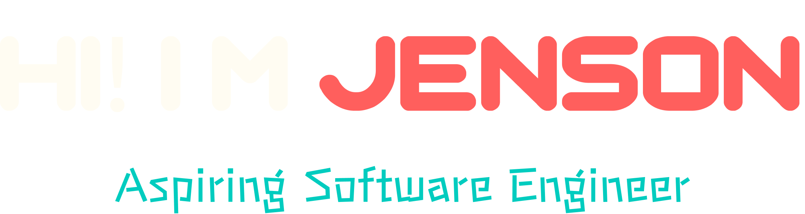

 

### 🧐 About Me 

- An aspiring Full Stack Developer from the Philippines who focused on building seamless and interactive applications using modern technologies.
- I love creating **web apps**, **UX design**, **PCB design** and some **IoT device**.

### 🛠 My Current Stack

- Programming Languages: JavaScript, Typescript, SQL, Python, C++, C# 
- Front-End Technologies: HTML, CSS, SASS, Tailwind CSS, React JS, Next JS 
- Back-End Technologies: Node JS, Express, Prisma, MySQL, PostgreSQL, Socket.io 
- Development Tools: Git, GitHub, Vercel, Heroku, Postman, VS Code, Linux, Arduino

### 💻 Projects

- **[🪑 JSFurniture](https://jsfurniture.vercel.app/)** - A furniture store where customers can find everything, they need to furnish their homes with style and comfort.
- **[🖥️ E-commerce Admin](https://ecommerce-admin-woad-eta.vercel.app/)** - A full-stack e-commerce admin app that users can create, manage, and link their online.
- **[🧳 PCRS](https://pet-carrier-rms.vercel.app/)** - Our undergraduate thesis project, a pet carrier rental system for malls that allows pet owners to rent pet carriers for 
their pets and track their location in real-time.

### 📬 Reach Me

- **[LinkedIn](https://www.linkedin.com/in/jensoncaparida/)**
- **[Instagram](https://www.instagram.com/jenzoone)**

 

 

